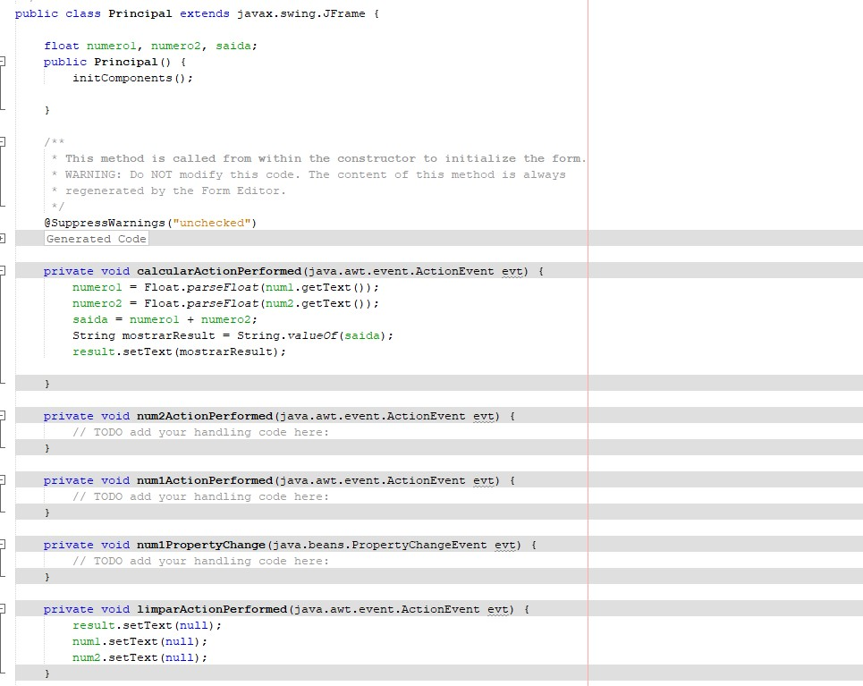

# Soma 2 numeros com JAVA e JFrame

<h2>Calcula a soma de 2 números no JAVA e JFrame</h2>

<h2>Código</h2>

Calculadora que soma 2 numeros. Feita na IDE NetBenas. Feita na linguagem Java.

<h2>Tecnologias</h2>

- JAVA 

- JFrame 

- GIT e GitHub 

<h2>Contato</h2>

viktorariel777@gmail.com

